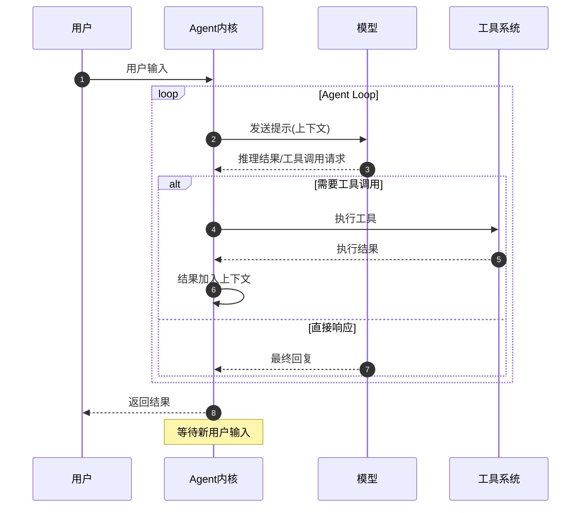
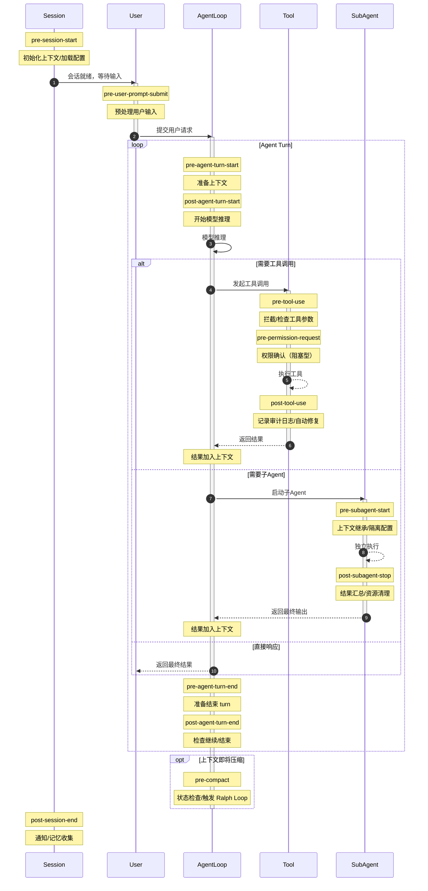

## 从神秘主义到工程

2026 年，Agent 开发正在经历一场范式转变：从依赖模型"涌现能力"的神秘艺术，转变为**可预测、可治理、可复现的工程学科**。

这不是说今天的 Agent 已经 deterministic——模型层依然是黑盒。但 Agent Engineering 的核心洞见是：**你不需要控制大脑，你只需要控制大脑与世界的接口**。

本文定义 Agent Engineering 的三层架构、Hooks 的六种工程实践，以及生产环境的及格线。

---


## 先澄清：什么已被商品化

在深入架构之前，必须先划定边界——以下技术已在 2024-2025 年被**工业级 SDK 商品化**，不再是 2026 年工程差异化的焦点：

| 技术领域 | 商品化载体 | 现状 |
|---------|-----------|------|
| **工具调用解析** | Claude Agent SDK、Vercel AI SDK、Kimi Agent SDK | 自动处理模型输出 → 结构化工具调用 |
| **上下文窗口管理** | 各 SDK 内置的 `context`/`memory` 模块 | Token 计算、截断算法、滑动窗口已实现 |
| **ReAct / Planning 循环** | SDK 提供的 `Agent`/`Task` 类 | 开箱即用的推理-行动循环 |
| **结构化输出 (JSON Mode)** | `generateObject()`、`tools` 参数 | 模型输出 Schema 约束已标准化 |
| **代码检索** | `ripgrep`、`ast-grep` | 符号搜索比向量搜索更可靠 |

这意味着：**2024 年的挑战是"让 Agent 能跑起来"，2026 年的挑战是"让 Agent 能放心地跑在生产环境"**。

本文不讨论如何造轮子——我们讨论的是在商品化内核之上，如何构建**可治理、可观测、可靠**的生产系统。

---

## 第一层：模型层——黑盒边界

最底层是模型层。Agent 工程师对这一层没有控制权，只有**边界认知**。

我们不关心 Transformer 的注意力头如何计算，不关心 MoE 的路由策略，不关心 RLHF 的奖励塑造。我们只关心一件事：**OpenAI/Anthropic Compatible API** 的输入输出契约。

模型层是不可控的。Agent Engineering 的第一课就是接受这一点：

- 不解释模型的"灵感"，只处理它的输出
- 不假设知识的一致性，只设计幂等的交互
- 不为模型的错误寻找原因，只为错误设计回退

> 模型是 Agent 的"大脑"，但我们不是神经外科医生——我们是**接口工程师**。我们的工作是确保这个不可控的大脑，只能通过受控的接口影响世界。

---

## 第二层：内核层——确定性接口

如果模型层是不可控的大脑，那么内核层就是**确定性的接口层**——它定义了大脑如何感知世界、如何行动、如何被约束。

内核层的核心是 **Agent Loop**（或者叫 ReAct Loop）：



这个循环看似简单，但其中包含四个关键的基础设施：

### 1. 基础工具调用（四种原语）

所有 Agent CLI 都基于四个原子工具：

| 工具     | 作用                     |
| -------- | ------------------------ |
| **读**   | 获取文件内容与项目信息   |
| **写**   | 创建新文件或覆盖已有文件 |
| **改**   | 基于 diff 的精确内容修改 |
| **执行** | 运行 shell 命令（bash）  |

搜索（grep/find）、网络请求（curl）、代码分析——本质上都是 **执行** 的子集。这四个原子操作构成了 Agent 与世界的全部交互。Agent Engineering 的核心任务，就是设计这些交互的**时序、约束与可观测性**。

### 2. 消息编织

Agent 需要处理三种消息的交织：

- **用户消息**：人类的意图输入
- **模型消息**：AI 的推理和决策
- **工具调用消息**：与外部世界的交互记录

如何将这些消息编织成模型能够理解的上下文，是内核层的核心艺术。这包括截断策略、摘要生成、重要性排序等技术。

### 3. Agent Hooks——标准化的脑机接口

这是内核层最重要的创新。**Agent Hooks 遵循 `pre/post-{event}` 的命名形式**，构成了 Agent 与外部治理系统的标准接口。

Hooks 是 Agent Engineering 的核心创新。它提供了三种控制能力：

- **通过返回值影响控制流**：决定是否继续、阻断或修改后续操作
- **通过 stdout 注入信息**：向上下文中动态添加系统消息
- **通过 stderr 输出遥测**：将事件发送到可观测系统

没有 Hooks 的 Agent 系统，就像没有防火墙的服务器——**不具备生产可用性**。



---

## 第三层：Harness 层——可组合的功能

内核层之上是 **Harness 层**——基于 Hooks 实现的可组合功能集合。

AGENTS.md、Skills、Sub-agent、Context Compression 等功能，本质上都是**Hooks 的预设组合**。它们是工程便利性的产物，而非新的原语。

一个合格的 Agent Engineer 应该理解：

- **AGENTS.md** = `pre-session-start` + `pre-agent` Hooks 的上下文注入
- **Skills** = `pre-agent` Hook 的条件化模板加载
- **Sub-agent** = `pre-tool-use` Hook 的进程委托
- **Context Compression** = `pre-compact` Hook 的自定义策略

> **Harness 层的所有功能都可以通过 Hooks 重建。Hooks 才是 Agent Engineering 的唯一原语。**

---

## Hooks 的六种工程实践

Hooks 不是摆设，而是工程化的杠杆。以下是六种经过验证的用法：

### 1. 通知（Notification）

在 Session 结束时通过语音、IM、邮件告知用户发生了什么。

```json
{
  "hooks": {
    "SessionEnd": [
      {
        "type": "command",
        "command": "notify-send 'Agent 任务完成'"
      }
    ]
  }
}
```

适用于长时间运行的后台任务，让用户不必盯着终端。

### 2. 授权（Authorization）

在特定事件发生后**阻塞 Agent Loop**，直到用户确认或超时。

```json
{
  "hooks": {
    "PreToolUse": [
      {
        "matcher": "Bash",
        "type": "command",
        "command": "confirm-destructive.sh"
      }
    ]
  }
}
```

与简单的"yes/no"不同，授权 Hook 可以要求 Agent 提供**替代方案**："检测到 `rm -rf`，请使用 `trash` 命令代替，或解释为何必须删除"。

### 3. 阻止（Blocking）

对特定操作直接禁止，无需人工介入。

```json
{
  "hooks": {
    "PreToolUse": [
      {
        "matcher": "curl .*apikey",
        "type": "command",
        "command": "block-secret-leak.sh"
      }
    ]
  }
}
```

阻止类 Hook 是安全策略的底线，一旦触发直接返回错误给 Agent。

### 4. 错误检查与自愈（Auto-fix）

在文件修改后自动运行检查，甚至直接修复。

```json
{
  "hooks": {
    "PostToolUse": [
      {
        "matcher": "Edit|Write",
        "type": "command",
        "command": "auto-fix.sh"
      }
    ]
  }
}
```

`auto-fix.sh` 的典型逻辑：

```bash
#!/bin/bash
# 1. 运行 markdownlint --fix
# 2. 运行 prettier --write
# 3. 运行测试，失败则回滚并通知 Agent
# 4. 启动 Sub-agent 进行代码审查（可选）
```

这是 CI/CD 的 Agent 内实现，让质量反馈延迟趋近于零。

### 5. 记忆收集（Memory Harvesting）

在会话结束时，拉起另一个 Agent Session 分析本次会话，识别摩擦点并记录。

```json
{
  "hooks": {
    "SessionEnd": [
      {
        "type": "command",
        "command": "harvest-memory.sh"
      }
    ]
  }
}
```

`harvest-memory.sh` 的工作流程：

1. 读取本次会话的完整日志
2. 启动专门的记忆提取 Agent
3. 识别反复出现的模式（"Agent 总是忘记运行测试"）
4. 追加到 `~/.config/agents/FEEDBACK.md` 或项目 `.agents/FEEDBACK.md`

这些记忆将在下次会话的 `pre-session-start` Hook 中被注入，形成**经验积累的正反馈**。

### 6. Ralph Loop（状态接力）

这是最高级的用法：在上下文即将压缩但任务尚未完成时，**主动终止当前会话，启动新会话继续执行**。

```json
{
  "hooks": {
    "PreCompact": [
      {
        "type": "command",
        "command": "ralph-loop.sh"
      }
    ]
  }
}
```

`ralph-loop.sh` 的典型逻辑：

1. 检查当前是否有未完成的 Issue（通过 `monoco issue` 或类似工具）
2. 记录当前进度：已修改的文件、已执行的测试、已发现的关键信息
3. 将这些信息写入 Issue Ticket 的 `context` 字段
4. **杀死当前 Agent Session**
5. 启动新的 Agent Session，传入精简后的上下文，继续执行

> 命名致敬 Ralph 循环（Ralph Loop），在赛车比赛中指车手超过自身极限后，通过短暂减速重新找回节奏的策略。
>
> Agent 也是如此：与其让上下文被压缩得面目全非，不如**主动重启，轻装上阵**。

---

## 及格线：Hooks 是唯一的硬指标

以上三层架构中，**Hooks 是唯一的硬指标**。

AGENTS.md、Skills、Sub-agent——这些功能层的东西只是锦上添花。它们确实有用，但本质上都只是**提示模型**的手段。模型可以选择遵循，也可以选择忽略。

**只有 Hooks 是确定性的**。

一个及格的 Agent CLI 必须提供完整的生命周期 Hooks：

| Hook                    | 作用                       |
| ----------------------- | -------------------------- |
| `pre-tool-use`          | 在工具执行前拦截危险操作   |
| `post-tool-use`         | 记录所有变更到审计日志     |
| `pre-agent`             | 在模型推理前注入额外上下文 |
| `pre-session-start/end` | 会话生命周期的治理点       |
| `pre-compact`           | 上下文压缩前的状态检查     |

你可以在 AGENTS.md 里写一百遍"记得写测试"，模型还是会忘；但如果你用 `post-tool-use` Hook 在每次文件修改后强制检查测试覆盖率，那测试就一定会存在。

**Hooks 是强制执行的约束，其他一切只是善意的建议。**

---

## 硬核玩家的选择

Harness 层的模块化设计，允许第三方插件直接操作 Agent 的工作流。

比如，一个 Git 预提交钩子可以：

1. 拦截 `git push` 命令
2. 调用 Sub-agent 进行代码审查
3. 如果审查报告非空，要求修复或记录问题
4. 只有问题解决后才允许推送

这类插件可以直接操作 Agent Hooks 来实现**恰到好处的 prompting**，并对控制流进行**硬干涉**。

> 黑客们往往更愿意确保自己的 opinionated design 被 hooks 强制执行，因此 hooks 才是硬核玩家的选择。

这正是为什么 Hooks 比单纯的 AGENTS.md 配置更强大——前者是**强制执行的约束**，后者只是**善意的建议**。

---

## 结语：Agent Engineer 的定位

Agent Engineering 不是关于控制模型，而是关于**控制接口**。

我们不构建大脑，我们构建**让大脑安全运作的约束系统**——通过 Hooks 定义何时可以行动、何时必须停止、如何被观测。

2026 年，Agent Engineering 已成为软件工程的核心子领域。它的成熟度标志着一个组织是否具备**生产级 AI 应用**的交付能力。

> 优秀的 Agent Engineer 懂得：创造力来自模型，可靠性来自工程。

---

## 后记：从 Session 到组织

写完上文，三个判断愈发清晰：

**第一**，Agent session 内的 engineering 最佳实践已经收敛。Hooks、上下文管理、工具调用规范——这些正在变成"传统工程"，不再是差异化焦点。

**第二**，一个关键方向是 **Grounding**：让 Agent 在具体行业、具体组织、具体合规审计要求下工作。Agent Hooks 的真正价值，在于成为 Agent 与下一代记录系统（ERP、CRM、合规审计平台）之间的**标准接口**。

**第三**，另一个关键方向是 **Swarming**——包括接力和并发。让 Agent 能够记录反馈、从模糊指令开始，进行调查研究，细化任务规格，执行实现，测试审计，合并部署。这需要使用 Issue Ticket、FEEDBACK.md、RALPH.md 等状态管理技巧，并通过 AgentHooks 进行集成，甚至有必要通过**事件驱动架构**进行编排。

> 2026 年我们解决"如何让 Agent 跑起来"，2027 年我们要解决"如何让 Agent 在组织中跑起来"。
